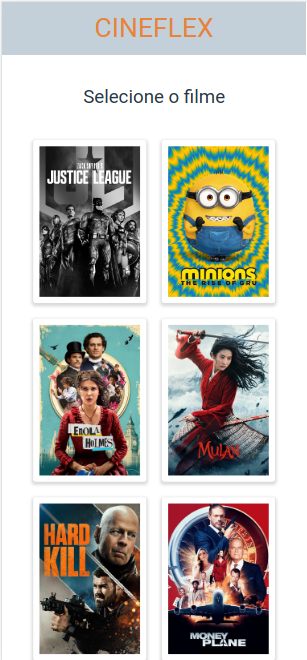
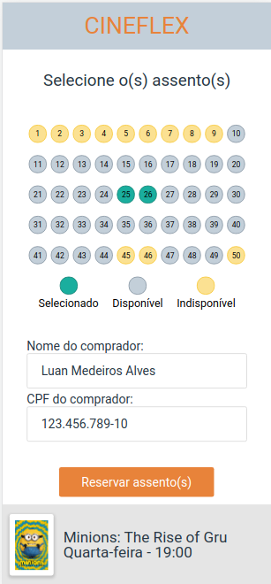
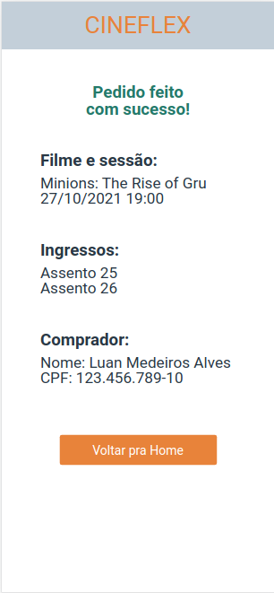

# 
 Project Cineflex

  

 

## ✏️ Description

A Single-Page Application that simulates a cinema website used to buy tickets. You can chose the movie, the session and the seats, getting a success screen in the end with all the informations.

 

##  
 :white_circle: Tecnologias

- [HTML](https://developer.mozilla.org/pt-BR/docs/Web/HTML)
- [CSS](https://www.w3schools.com/css/)
- [JavaScript](https://developer.mozilla.org/pt-BR/docs/Web/JavaScript)
- [Styled Components](https://styled-components.com/)
- [React](https://reactjs.org/)
- [React Router](https://reactrouter.com/)

 
